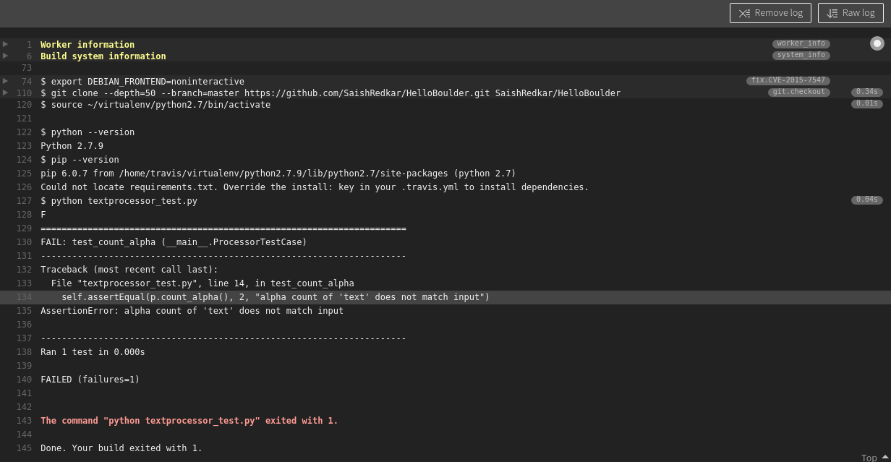
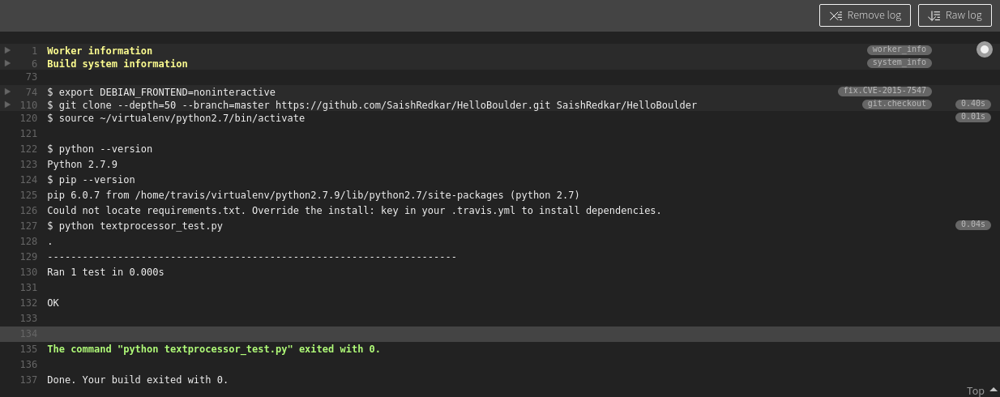

# HelloBoulder
A sample repository to demonstrate a proper open source setup [ For HW #3 ] and for setting up continuous intergration using TravisCI [ For HW #4 ].

The textprocessor_test.py script runs everytime you build the system. This script contains a unit test case for the count_alpha method in textprocessor.py.

### Build Error 

### Build Successful 

